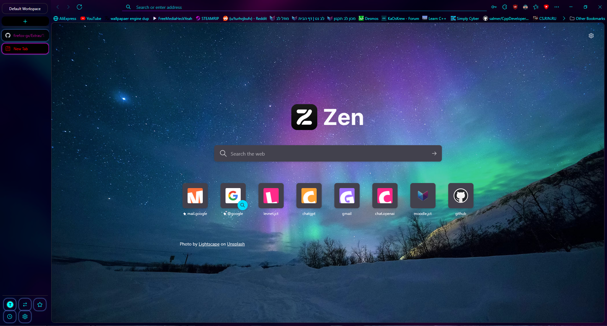

# neon/cyberpunk theme for zen-browser

<b>Steps to configure the theme:</b>
<ol>
   <li>Download the theme(chrome.rar & user.js) from the <b> << Releases >> </b> section, in the right side of this page</code></li> 
   <li>extract the files in the 👉<code>chrome.rar</code>👈 to your Firefox profile directory/chrome(create that folder if you do not have it already)
      and the 👉<code>user.js</code>👈 file into your Firefox profile directory. </li>
 
   <li>Restart the browser. </li>
</ol>

<ul><li>
<b> To find out the location of your profile directory go to about:support or about:profiles.</b>
</li></ul>

# Some stuff
<ul>
<li>No compatibility for RTL(right-to-left) languages.</li>
<li>Tnx for firefox opera gx for the inspiration(read.me & the image for background is directly taken from there, code base is written only by me, but the theme colors and look are inspired from it)</li>
</ul>

